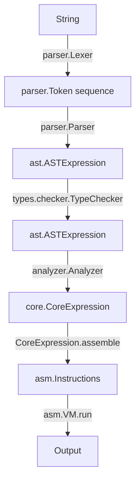

A simple compiler/interpreter.

The main flow:

Things to do:

- non-generic type parameters for constructors
- pattern matching against data types
    - rewrite if to pattern match
- explicit type definitions
- type aliases
- type classes
- newtype declarations
- type declarations for stdlib
